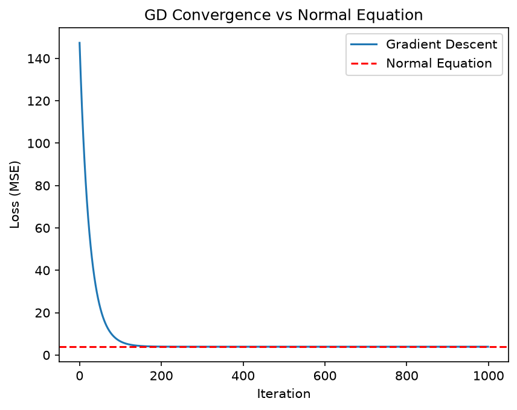

# ml-from-scratch
A learning project where I implement fundamental machine learning
algorithms using Python and NumPy.

My goal is to understand the mathematics behind the models,
verify my implementations, and explore their behavior through experiments.

##Implementations

-Linear Regression

-KNN

##Experiments and Results

###Gradient Descent vs Normal Equation

I compared both methods on the same synthetic dataset with 200 samples, two features, and noise.
Gradient descent was tested with 1000 iterations and a learning rate of 0.01.

| Method | Training MSE |
|--------|-------------:|
| Gradient descent | 3.932201 |
| Normal equation | 3.932201 |

The mean squared difference between their predictions was
approximately 1.60e-14. Gradient descent therefore reached nearly
the same solution as the normal equation in this experiment.

| Parameter | True Value | Gradient Descent   | Normal Equation   |
|-----------|-----------:|-------------------:|------------------:|
| w₁        | 2.0        | 1.89951185         | 1.89951195        |
| w₂        | 6.0        | 6.23891666         | 6.23891662        |
| b         | 10.0       | 9.994443176324776   | 9.994443261031517  |

Both methods produced nearly identical parameter estimates.
The estimates differ from the true values because noise was
added to the targets.



The graph shows how the training MSE changes during gradient descent.
The blue curve represents gradient descent, while the dashed red line
shows the MSE obtained by the normal equation.

The loss decreases rapidly during the initial iterations and then
approaches approximately 3.9322, matching the normal-equation result.
This indicates that gradient descent converged close to the
least-squares solution for this dataset.

The loss does not reach zero because noise was added to the
targets, so a linear model cannot fit every sample exactly.

## Installation

```bash
git clone https://github.com/batusertkaya/ml-from-scratch.git
cd ml-from-scratch
python -m pip install numpy matplotlib
```

## Usage

Run from the repository root:

```bash
python -m experiments.linear_regression.compare_solvers
```

This prints the learned parameters and MSE values, then displays
the loss curve.

## Project Structure

- `models/`: Model implementations.
- `experiments/`: Experiments using those implementations.
- `figures/`: Figures obtained from experiments.

## Next Steps
Implement and experiment with the following algorithms:

-Logistic regression

-Naive-Bayes

-Decision tree

-K-means
